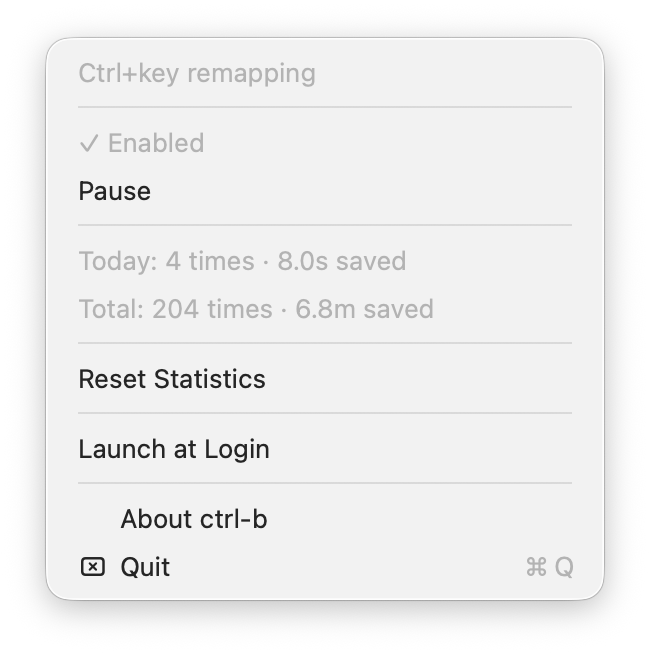
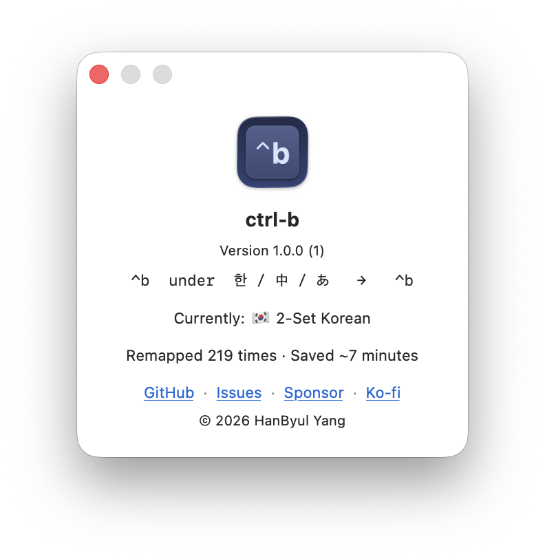

# ctrl-b

[](https://github.com/yhbyhb/ctrl-b/actions/workflows/ci.yml)

日本語IMEが有効なときにターミナルでCtrl+キーショートカットが効かなくなる問題を解決する、macOSメニューバーユーティリティです。

> 日本語IMEがオンのままtmuxで `Ctrl+b` を押しても何も起きない？ctrl-bがそれを解決します。

[English](README.md) | [中文](README.zh.md)

## 問題

macOSでIME（日本語・中国語・韓国語など、CJK入力ソース）が有効な状態でターミナルを使うと、`Ctrl+b`（tmuxプレフィックス）などのCtrl+アルファベットショートカットが無音で無視されます。IMEが `interpretKeyEvents:` レイヤーでキーイベントを消費してしまい、ターミナルにイベントが届かないためです。

## 仕組み

ctrl-bはメニューバーアプリとして動作し、CGEventTapを使ってキーボードイベントを傍受します。IMEが有効な状態でCtrl+アルファベットキーの押下を検出すると：

1. 元のイベント（IMEメタデータを含む）を消費します。
2. IMEメタデータを持たないクリーンな合成CGEventを生成します。
3. 合成イベントを送出し、ターミナルが正常に処理します。

**プレフィックス後続キーのサポート**: `Ctrl+b`（tmuxプレフィックス）がリマップされた後、1.5秒以内に押された次のキーもリマップします。これにより `Ctrl+b` → `n`（新しいウィンドウ）などの組み合わせもシームレスに動作します。

## 対応IME

`TISTypeKeyboardInputMode` として登録されたすべてのmacOS IMEに対応しています。言語を個別に判定せず、すべてのCJK入力ソースと互換性があります：

- **日本語**: ひらがな、カタカナ
- **中国語**: ピンイン（簡体字）、注音 / 倉頡（繁体字）、五筆など
- **韓国語**: 두벌식（2ボタン式）、세벌식（3ボタン式）
- **ベトナム語**: Telex、VNIなど
- **その他**: IMEモードベースのすべてのmacOS入力ソース

ABC、AZERTY、QWERTYなどの通常のキーボードレイアウトには影響しません。IMEが有効なときのみ動作します。

## スクリーンショット

<p align="center">
  
  &nbsp;&nbsp;&nbsp;
  
</p>

## インストール

### ダウンロード（推奨）

1. [最新リリース](https://github.com/yhbyhb/ctrl-b/releases/latest)から `ctrl-b.app.zip` をダウンロードします。
2. 解凍して `ctrl-b.app` を `/Applications` に移動します。
3. ctrl-bを起動します。

> **注意:** 現在のリリースバイナリは署名されていないため、macOSが初回起動時にブロックする場合があります。
> 開く方法: **右クリック → 開く**、またはターミナルで以下を実行してください：
> ```bash
> xattr -cr ctrl-b.app && open ctrl-b.app
> ```

### ソースからビルド

```bash
git clone https://github.com/yhbyhb/ctrl-b.git
cd ctrl-b
make app
make install
```

### 動作環境

- macOS 13 (Ventura) 以降

## 初期設定

起動後、**アクセシビリティ権限**を許可します：

**システム設定 → プライバシーとセキュリティ → アクセシビリティ → ctrl-b → オン**

権限が許可されると、ctrl-bは自動的に動作を開始します。再起動は不要です。

### なぜアクセシビリティ権限が必要なのか？

ctrl-bはCGEventTapを使用してシステムレベルでキーボードイベントを傍受・置換します。イベントを消費しながらIMEメタデータのないクリーンな合成イベントを送出するには、このAPIが唯一の手段であり、アクセシビリティ権限が必要です。

## 使い方

メニューバーの **⌃b** アイコンをクリックすると：

- リマッピングのオン/オフ切り替え
- リマップ統計の確認（本日 / 累計）
- 統計のリセット
- ログイン時の自動起動切り替え
- アップデートを確認
- Aboutパネルを開く（バージョン、現在のIME、セキュアキーボード入力の状態、リンク）

## 開発

```bash
swift build -c release   # ビルド
swift test               # テスト実行
make lint                # SwiftLint (--strict)
make lint-fix            # lint問題の自動修正
make setup               # gitフックの設定（クローン後に一度だけ実行）
```

**開発環境:** Xcode Command Line Tools、[SwiftLint](https://github.com/realm/SwiftLint)（`brew install swiftlint`）

コントリビューションのガイドラインは [CONTRIBUTING.md](CONTRIBUTING.md) を参照してください。

## サポート

ctrl-bは無料で、空き時間に開発しています。お役に立てたなら、スポンサーとしてメンテナンスを応援していただけると嬉しいです: [GitHub Sponsors](https://github.com/sponsors/yhbyhb) · [Ko-fi](https://ko-fi.com/yhbyhb)

## ライセンス

MIT — [LICENSE](LICENSE) を参照
